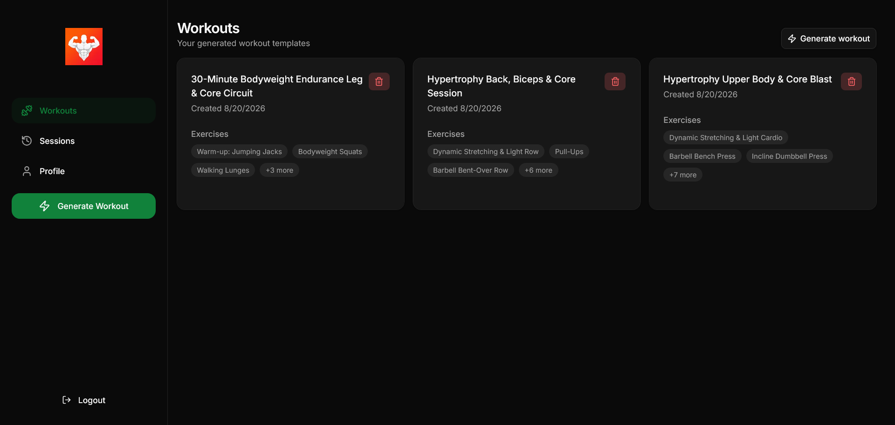
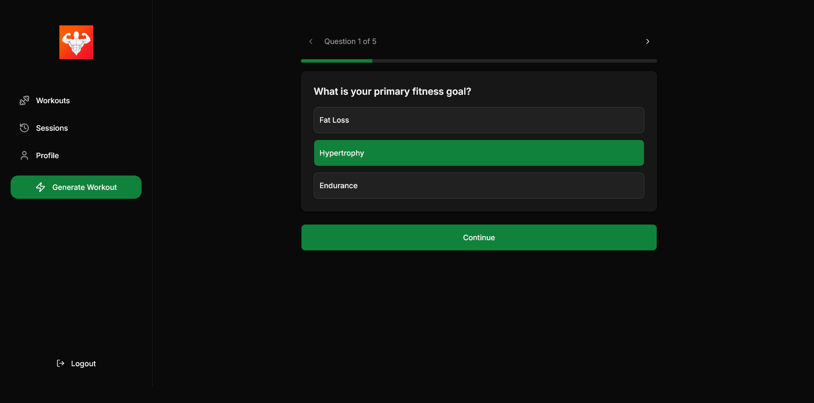
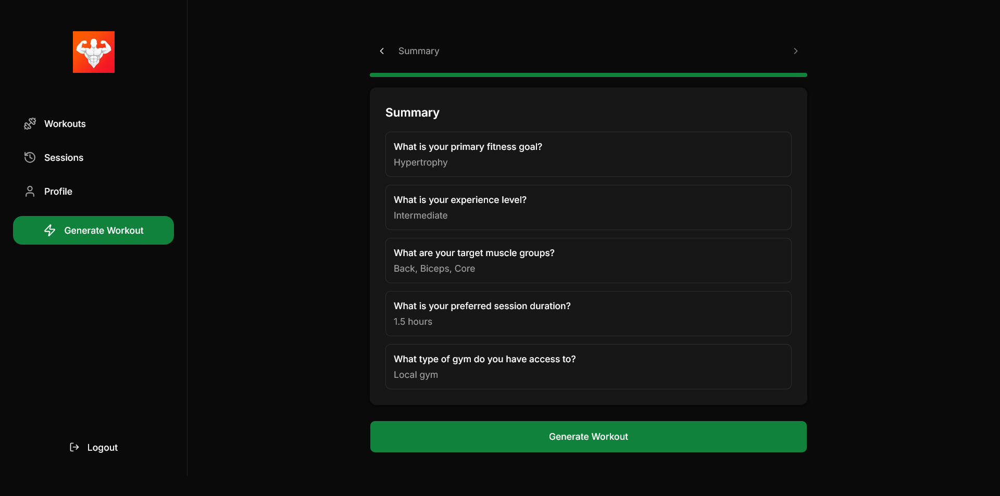
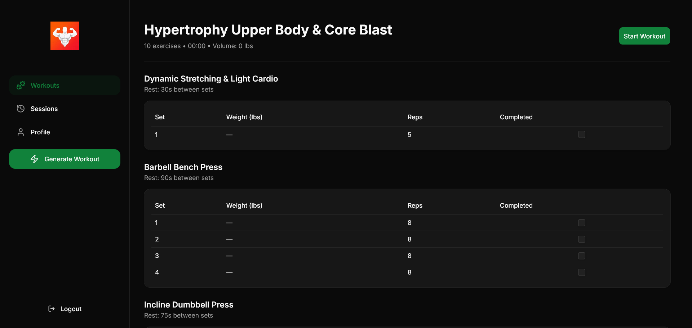
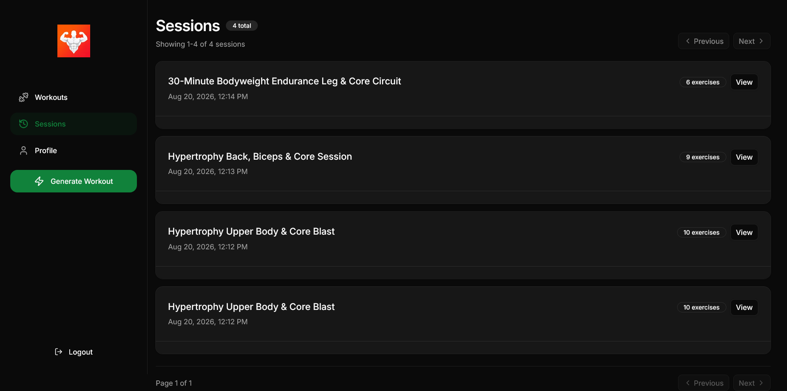

# Hypertrophy - An AI powered personalized workout generator
Hypertrophy is a Next.js powered web application that takes trainee preferences as a quiestionnaire and then generate a matching workout program.

## Features
- Authentication via Google OAuth
- Generate a personalized workout plan
- Complete a workout session
- View past workout sessions

## Todo
- [ ] Requesting generated workout editing via voice
- [ ] In session exercise editing and adding
- [ ] Basic stats (some graphs to view progress etc.)
- [ ] In session weight and reps auto-filling
- [ ] Deploying to vercel after bug fixing

## Screenshots

